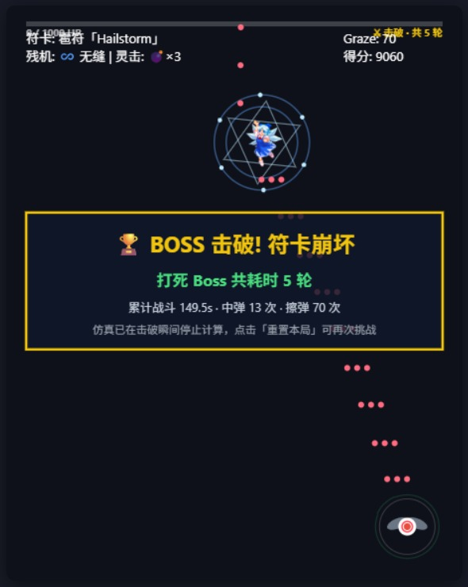
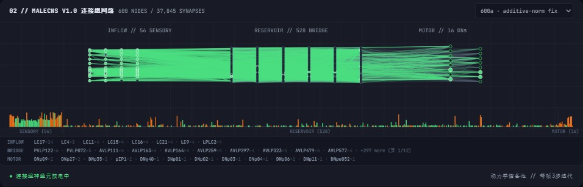
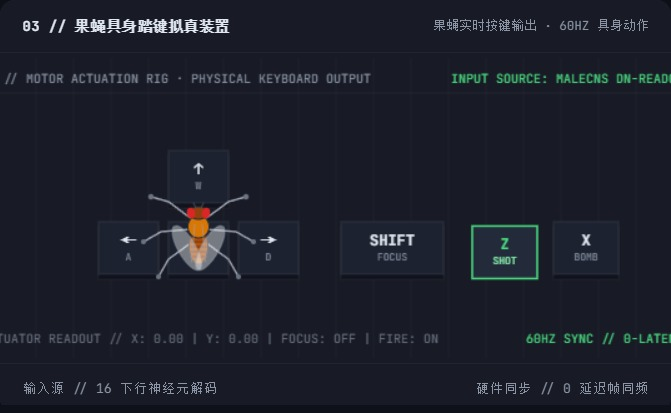
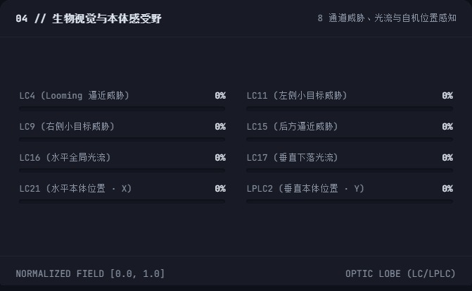
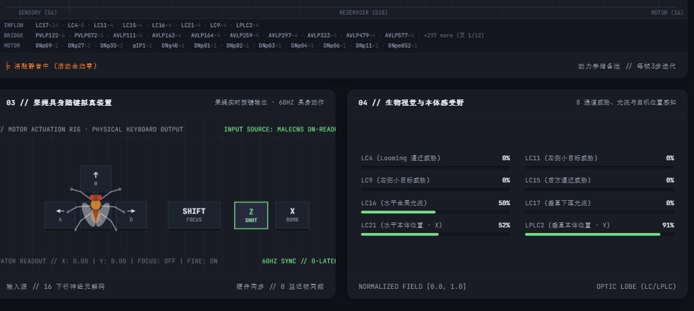

# 果蝇玩东方 · Fly Touhou

> **一只拥有真实测定脑神经连接组的黑腹果蝇，能不能在东方 Project 的弹幕里自己躲开一切？**
> 这里没有脚本、没有规则引擎、没有强化学习大模型 —— 只有一个从电子显微镜重建出来的大脑，和 320 个可训练参数。

**English TL;DR** — A *real* connectome (FlyEM MaleCNS v1.0, reconstructed from EM volumes of a male *Drosophila* ventral nerve cord) drives a fly playing a Touhou 6 bullet-hell. The only trainable part is a 320-parameter zero-bias readout, evolved by CEM. No hand-coded evasion logic. Ablating the connectome collapses performance to a motionless baseline, so the behavior demonstrably comes out of *this* brain. Larger brains, wider sensors, plastic synapses and denser wiring were all tried — **all measured as no gain**, and the negative results are published here too.


---

## 目录

- [30 秒看懂](#30-秒看懂)
- [它是怎么工作的](#它是怎么工作的)
- [成绩（可复现口径）](#成绩可复现口径)
- [唯一站得住的强结论：因果性](#唯一站得住的强结论因果性)
- [负面结果：这个项目最诚实的部分](#负面结果这个项目最诚实的部分)
- [怎么跑](#怎么跑)
- [目录结构](#目录结构)
- [数据溯源](#数据溯源)
- [口径声明与已知问题](#口径声明与已知问题)
- [许可与素材声明](#许可与素材声明)

---

## 30 秒看懂

**主战场。** 460×580 的弹幕竞技场，自机是那只小虫，它每一帧的动作都由那颗脑算出来。这张是它把 Boss 血条打空后的**符卡崩坏战报** —— 注意"共耗时 5 轮"这个口径：它是跨复活累计的，因为一只苍蝇也会死很多次：



**脑本身。** 传入细胞（视觉）→ 中间神经元储备池 → 下行神经元（运动），绿色亮点是实时放电：



**它怎么"动手"。** 16 个下行神经元的活动映射到一张虚拟键盘，你能看见哪个键被"按"下去：



**它"看见"什么。** 不是像素，是 8 个有生物命名的视觉通道 —— 逼近威胁、左右小目标、全局光流、本体位置：



---

## 它是怎么工作的

```
8 通道视觉感知  →  32/56 传入细胞  →  中间神经元储备池  →  16 下行神经元(DN)  →  320 参数读出  →  4 动作
   (LC4/LC9/...)     (真实测定)        (真实突触边, 冻结)      (真实运动神经元)      (唯一可训练)     (移动+射击)
```

**动力学**（`src/brain/connectome.js`）—— 泄漏 tanh 速率单元，每帧迭代 3 次：

```js
h = 0.3·h + 0.7·tanh(drive + 1.4·Σ W·h)      // W = 真实测定的突触连接权重，全程冻结
```

**读出层**（`src/brain/policy.js`）—— 整个系统唯一可训练的东西：

```
16 DN → 16 (tanh) → 4 动作      =   16×16 + 16×4 = 320 个参数，两个偏置项恒为 0
```

**训练**（`train.js`）—— CEM（交叉熵方法）进化搜索这 320 个数。评估环境就是**真实游戏引擎本体**（`src/game/danmaku.js`，th06 符卡数值移植），不是简化代理环境，所以不存在"训练环境与运行环境脱节"。

** transmitter 符号**：乙酰胆碱 +1，GABA / 谷氨酸 −1，未知与调质 0。

> ⚠️ 这是一份**工程化的抽象**，不是生理模型。输入注入是人为设计的 8 通道，神经元是速率单元。它回答的问题是"这颗脑的接线图里能不能读出避障行为"，不是"果蝇是不是这样思考的"。

---

## 成绩（可复现口径）

**评估口径**：20 个独立测试种子（80001–80020），单局上限 1800 帧，60 fps。所有数字从 checkpoint 原始文件核实。

| 配置 | 规模 | 测试均值 | 秒数 | 说明 |
|---|---|---|---|---|
| **v1** | 80 节点 / 1,296 边 | **1544.85** | 25.75s | 原版，对外主口径 |
| **v600a** 🏆 | 600 / 37,845 | **1538.15** | 25.64s | 全案冠军（加性两段归一化修好稀释后） |
| v600b | 600 / 37,462 | 1374.9 | 22.9s | v1 读出恢复（C 案，方向正但未证实） |
| v600 | 600 / 37,845 | 1235.6 | 20.6s | 原归一化，稀释导致回归 |
| `circuitSilenced` | — | 885.75 | 14.76s | 消融静音：脑归零，读出与输入不变 |
| `idle` | — | 885.75 | 14.76s | 完全不动 —— **与静音逐位相同** |
| `randomPolicy` | 600a 场 | 685.45 | 11.4s | 随机权重读出 |

**关键噪声基准（务必读这条）**：冻结臂只换一颗 CEM 训练随机种子，测试均值就从 1369.5 → 1306.3，**极差 63.3 帧**。
⇒ 任何小于 ~10% 的"提升"必须**跨 CEM 种子重训复现**，只换测试种子不算复现。这一条同时解释了本项目两次差点误报的"+2.9%"和"+6.0%"假象。

---

## 唯一站得住的强结论：因果性

```
trained 1544.85  ≫  silenced 885.75  ≡  idle 885.75  >  random 685.45
```

把连接组静音（解码器不变、输入不变、只有脑的活动归零），成绩立刻塌到**和完全不动一模一样**。

这不是统计推断，是**当场可演示的因果实验** —— 网页上点一下「● 连接组神经元放电中」就能现场切换：



看这张图里的三件事同时成立：

- 状态栏「**○ 消融静音中（活动全归零）**」，放电率 `0 / 600`
- 右侧感知条**完全正常**（LC16 58%、LC21 52%、LPLC2 91%）—— 眼睛还在看
- 中间执行器读数 `X: 0.00 | Y: 0.00 | FOCUS: OFF`，四个键**一个都没按** —— 身体不动了

输入没变、解码器没变，只有那颗脑被拔掉，行为就归零。

市面上多数"AI 玩游戏"的演示只能给你看结果。这里能给的是：**拔掉脑子，行为立刻消失。**

---

## 负面结果：这个项目最诚实的部分

每一条直觉上"应该让它更强"的路线，我们都实测了，然后**全部否证**：

| 尝试 | 判决 | 关键数字 |
|---|---|---|
| 神经元 80 → 600 | ❌ 无能力收益 | 修好稀释后仅追平 v1（p=0.91）；预算 ×3 的终审 p=0.3776 不显著 |
| 生物拓扑 vs 随机重连对照 | ❌ **拓扑零优势** | 控制组 1397.8 vs 生物 1386.3，Δ = −12 帧，**p = 0.9351** |
| 感知 8 → 32 通道 | ❌ 伤得更狠 | A 1369.5 / B 1010.3 / C 1271.4 ⇒ **−26.2%**，B 胜 0/20。机制：空扇区驱动是 −1 而不是 0，把 24 个细胞钉成恒定偏置 |
| 322 参数增益把手 | ❌ 判负 | CEM 学成了"关闸"退化解，测试 1386.3 < 1538.2 |
| Hebbian 突触可塑性 | ❌ 无可复现提升 | 换一颗 CEM 种子，+82.1 帧翻转为 −16.5 帧；效应量 ≤ 噪声 63.3 |
| 提高连接密度 | ❌ 有害 | 稀疏度 16 完胜稠密 30/45 |

**结论**：在这个任务上，"更大的脑 / 更多的眼睛 / 可塑的突触"都不买账。320 个参数 + 一份 80 节点的接线图就已经触到了这个环境的天花板。

这不代表项目失败 —— 它代表**"更大即更强"这个默认叙事，在一个可复现的小实验里被证伪了**。

还没试过的只剩两条：P1（加宽读出，但输入维度仍是 16 DN）与换任务。

---

## 怎么跑

**零依赖、零构建步骤。** 纯 ES Module + 原生 Canvas + `fetch` JSON。Node 18+ 即可。

### 打开网页

```bash
node server.js          # 或 Windows 下双击 启动.bat
# → http://localhost:3000
```

开发服务器带 `Cache-Control: no-store`，改代码刷新即生效。

### 训练

```bash
# v1（80 细胞），单进程
node train.js

# 600 细胞图，14 线程并行评估，100 代 × 64 候选
node train.js --graph public/data/connectome/graph600.json \
              --out public/data/checkpoint600.json \
              --workers 14 --generations 100 --pop 64

# 可复现关键：CEM 采样由 mulberry32(cemSeed) 驱动，默认 20260916
#   同 --graph/--generations/--pop/--elite/--seeds/--cem-seed 下 bestWeights 位可复现
node train.js --cem-seed 20260917 --no-controls   # 不涉及拓扑主张时省一半机时
```

### 回归闸门

```bash
node test_integration.js
# 4 个数据集 × {正常 120 帧无 NaN / 消融静音输出全 0 / 闯关 Stage 1-3 / matched control 度守恒}
# 当前状态：0 错误
```

### 网页参数

`?brain=v1|v600|v600a|v600b` 直接指定连接组数据集；页面上也可下拉切换。

---

## 目录结构

```
index.html                  单页工作台（中英双语，无框架）
server.js                   开发静态服务器 :3000（no-store）
train.js                    CEM 训练器（含 matched control 与配对 bootstrap）
test_integration.js         项目回归闸门
src/
  game/danmaku.js           游戏引擎：th06 符卡 ECL 移植、自机、Boss、8/32 通道感知口径
  game/spellcards/          符卡（雹符 Hailstorm / 冥符 紅色の冥界 等）
  brain/connectome.js       连接组储备池动力学 + 可选 Hebbian 可塑性（默认关闭）
  brain/policy.js           唯一可训练参数：320 个零偏置读出权重
  brain/eval_core.js        独立测试集评估（与训练同口径）
  brain/circuits.js         回路级标注辅助
  visualizer/               连接组渲染、按键拟真装置
  app.js / i18n.js          页面装配与国际化
public/
  data/connectome/          graph{,600,600a,600b}.json + manifest*.json
  data/checkpoint*.json     各数据集已训练读出
  images/ audio/            游戏素材
tools/                      ECL 反汇编、弹型渲染、规模消融仪表等分析脚本（不参与运行时）
docs/
  screenshots/              本 README 用的 6 张实测图
  design/                   交接文档、PLAN_520 与其评审报告、th06 弹幕深度解析
```

以下目录是**本地工作区，不进仓库**（见 `.gitignore`）：`_research/`（原始数据下载与研究沙箱）、`experiments/`（实验脚本、checkpoint 与工作日志）、`_archive/`、`_trash_*/`（清理产物）。

---

## 数据溯源

- **数据集**：FlyEM **MaleCNS v1.0**，最小置信度 0.5
- **来源**：https://male-cns.janelia.org/download/ （HHMI Janelia Research Campus）
- **许可**：CC BY 4.0
- **规模**：v1 = 80 节点 / 1,296 边 / 26,029 突触接触点；v600 = 600 节点 / 37,845 边 / **1,129,414 接触点**
- **图校验**：`graph.json` sha256 = `2424c9dd2e44534e600aeda1a9058039b1f22a4bd983284a27adc10b22130719`
- **选体规则（写在 manifest 里，可审计）**：8 种具名视觉细胞各取直接 DN 接触数前 4 → 每型 DN 目标前 2 取并集补足 16 → 按最小入/出接触强度取前 32 个二跳桥接细胞 → 保留全部实测有向内部边。**平票按 body ID。没有任何一环节使用游戏结果做选择。**

`test_integration.js` 每次运行都会重新校验这条完整性链（节点/边/接触点数与 sha256 匹配）。

---

## 口径声明与已知问题

写在这里是为了不让人踩坑，也是为了不让人被数字骗到：

1. **`checkpoint600a.json` 里的 `topologyAdvantagePercent: 17.96 / p: 0.0403 / significant: true` 是无效数据，禁止引用。** 同文件的 `controlIntegrity` 字段自己标注了 `INVALID`：修复前的一处 `--workers` bug 让对照候选在生物图上打分。**全项目唯一有效的拓扑对照是 `checkpoint600ag.json`**（1397.8 vs 1386.3，p=0.9351 ⇒ 零优势）。
2. **训练适应度截断在 1200 帧，测试用 1800 帧。** 训练分不清"活 1200"和"活 1800"。做小收益改动前应把它提到 1800。
3. **历史 run 不可精确复现**（`cemSeed` 引入前的产物）。新 run 已播种，默认 `20260916`。
4. **单次 CEM 训练本身就是一个有噪声的样本**（见上节 63.3 帧极差）。
5. 工具栏 `.runtime` 是 `flex-wrap: wrap`，切换数据集时文案长度变化会让按钮组换行位置跳动一下 —— 快速连点可能点错档。
6. `sensoryMode: 'wide'`（32 通道感知）**只在引擎层**（`src/game/danmaku.js`），网页上没有控件。该路线已判负，故无功能损失。
7. 连接组面板标题恒显示「MALECNS **V1.0** 连接组网络」，即使切到 600/600a/600b 也不变（副标题的节点/边数是正确的）。纯文案遗漏。

---

## 许可与素材声明

- **代码**：见 `LICENSE`（建议 MIT；正式添加前请先确认）。
- **神经连接组数据**：FlyEM MaleCNS v1.0，CC BY 4.0，© HHMI Janelia —— 请按要求署名。
- **东方 Project 相关素材与符卡数值**：版权归 **ZUN / 上海アリス幻樂団** 所有。本项目为**非商业**研究/科普演示，不含任何游戏原始可执行文件；音效与立绘沿用同人惯例分发，如权利方要求会立即替换或下架。
- 本项目**不是**对果蝇神经系统的生理仿真，也不主张任何生物学结论。它是一个可复现的连接组读出实验。

---

<p align="center">
  <b>一只苍蝇，一颗真的脑子，320 个参数，和一堆诚实的"没用"。</b>
</p>
